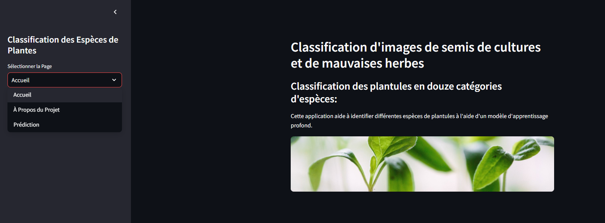

# Classification d'Espèces de Plantes

Ce projet est une application de classification d'images qui identifie différentes espèces de plantules en utilisant un modèle d'apprentissage profond. L'application utilise un modèle basé sur EfficientNet pour classifier des images de semis de cultures et de mauvaises herbes en 12 catégories différentes.



## Application en Ligne

L'application est déployée et disponible en ligne à l'adresse suivante :
**[https://plant-species-classification-tn.streamlit.app/](https://plant-species-classification-tn.streamlit.app/)**

Vous pouvez y accéder directement sans avoir à installer quoi que ce soit sur votre machine.

## Jeu de Données

Le projet utilise le [V2 Plant Seedlings Dataset](https://www.kaggle.com/datasets/vbookshelf/v2-plant-seedlings-dataset) de Kaggle, qui contient des images de plantules à différents stades de croissance.

Les classes de plantules disponibles sont :
- Black-grass
- Charlock
- Cleavers
- Common Chickweed
- Common wheat
- Fat Hen
- Loose Silky-bent
- Maize
- Scentless Mayweed
- Shepherds Purse
- Small-flowered Cranesbill
- Sugar beet

## Technologies Utilisées

- TensorFlow / Keras pour le modèle d'apprentissage profond
- Streamlit pour l'interface utilisateur
- EfficientNet comme architecture de base du modèle
- OpenCV et PIL pour le traitement d'images

## Installation

1. Clonez ce dépôt :
```
git clone https://github.com/Yassine-Mhirsi/Plant-Species-Classification.git
cd Plant-Species-Classification
```

2. Installez les dépendances requises :
```
pip install -r requirements.txt
```

## Exécution de l'Application

Pour lancer l'application Streamlit, exécutez :
```
streamlit run main.py
```

L'application offre trois sections principales :
- **Accueil** : Aperçu du projet
- **À Propos du Projet** : Détails sur le jeu de données et l'architecture du modèle
- **Prédiction** : Interface pour télécharger et classifier vos propres images, ou pour explorer des exemples de chaque espèce

## Structure des Données

Pour que l'application fonctionne correctement avec les exemples d'images, veuillez organiser vos images comme suit :
```
data/
└── test/
    ├── black-grass/
    ├── charlock/
    ├── cleavers/
    └── maize/
    └── ....
```

## Modèle

Le modèle utilisé (`plant_classification_modelv2.h5`) est basé sur EfficientNet avec des couches de classification personnalisées. Assurez-vous que ce fichier de modèle se trouve dans le même répertoire que `main.py`.
 
